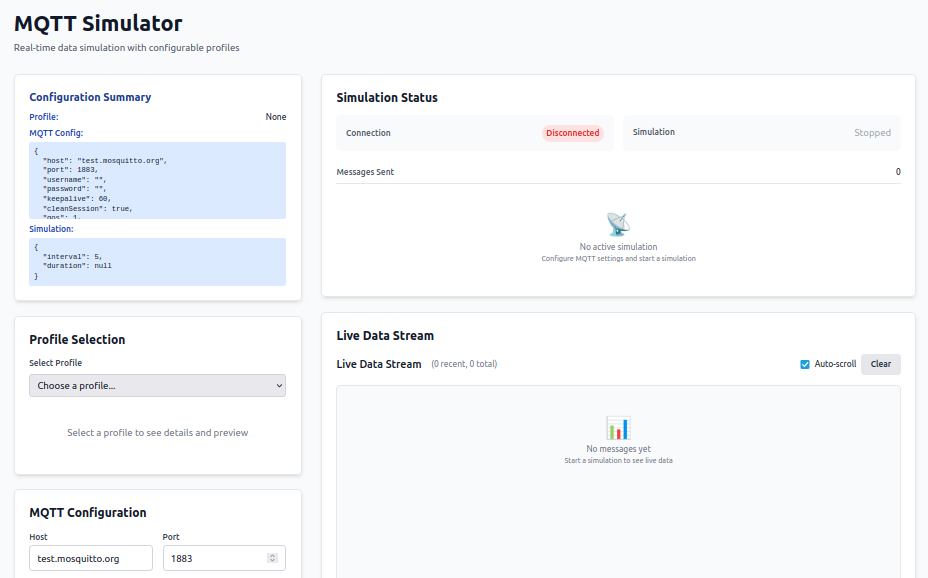

[](https://github.com/ninomirabile/mqttSimulator/actions/workflows/ci.yml)

# MQTT Simulator



Real-time data simulation with configurable profiles

## Features

### Core Features
- **Modular MQTT Client**: Connect, publish, subscribe, and disconnect with full MQTT protocol support
- **Configurable Profiles**: Plug-and-play data generators for different domains
- **CLI Interface**: Command-line tool for quick simulations
- **Python Library**: Use as a library in your Python projects

### Web Interface (New!)
- **Modern Dashboard**: Beautiful Svelte-based web interface
- **Dynamic Profile Form**: When you select a profile, specific fields (e.g. city, sensor_id, etc.) appear and can be edited, with live payload preview
- **Advanced MQTT Configuration**: Clear form for host, port, QoS, retained, clean session, last will, etc.
- **Live Config Summary**: Box showing all selected parameters (profile, broker, QoS, retained, etc.) in real time
- **Improved Visual Feedback**: Connection and simulation status always visible (icons/colors), clear error/success messages
- **Guided Dashboard**: User experience is clear and step-by-step
- **Live Data View**: Real-time display of published data
- **Connection Testing**: Test MQTT connections before starting simulations

## Changelog

### [Next version]
- New dynamic form for profile parameters, with live preview
- Improved MQTT configuration (all parameters visible and editable)
- Live config summary always visible
- Connection/simulation status always highlighted
- Clearer, more guided UX

## Screenshot


## Architecture

```
mqtt-simulator/
├── mqtt_simulator/          # Core Python library
├── api/                     # FastAPI REST API
├── frontend/                # Svelte web application
└── tests/                   # Test suite
```

## Quick Start

### 1. Install Dependencies

```bash
# Install Python dependencies
pip install -r requirements.txt
pip install -r requirements-api.txt

# Install frontend dependencies
cd frontend
npm install
cd ..
```

### 2. Start the Backend API

```bash
python3 -m uvicorn api.main:app --reload --host 0.0.0.0 --port 8000
```

The API will be available at `http://localhost:8000` with interactive docs at `http://localhost:8000/docs`.

### 3. Start the Frontend

```bash
cd frontend
npm run dev
```

The web interface will be available at `http://localhost:5173`.

### 4. Use the Web Interface

1. Open `http://localhost:5173` in your browser
2. Select a profile (weather, agriculture, energy)
3. Configure MQTT settings and test connection
4. Set simulation parameters (interval, duration)
5. Start the simulation and watch live data!

## Quick Online Test

To make it easy for anyone to try the system immediately, the dashboard automatically pre-fills a free public MQTT broker:

- **Host:** test.mosquitto.org (pre-filled)
- **Port:** 1883 (pre-filled)
- **Username/Password:** leave blank

Just start the backend and frontend, open the dashboard at http://localhost:5173, and click "Test Connection". If you see "Connected", you can start simulating right away!

**Motivation:** This choice allows anyone who clones the project to test MQTT simulation without having to install or configure a local broker.

---

## MQTT Configuration

The dashboard defaults to the public broker test.mosquitto.org:1883 to make testing immediate, even for those without a local broker. You can change host/port at any time.

**Cloud configuration example (default):**
- Host: test.mosquitto.org
- Port: 1883
- Username/Password: (leave blank)
- QoS: 0, 1, or 2
- Retained: false
- Clean Session: true

## Usage

### Web Interface

The web interface provides a complete GUI for:
- **Profile Selection**: Choose from available simulation profiles
- **MQTT Configuration**: Set broker details, QoS, authentication, etc.
- **Connection Testing**: Verify MQTT connectivity before starting
- **Simulation Control**: Start/stop simulations with real-time status
- **Live Data View**: See published messages in real-time

### Command Line Interface

```bash
# Basic usage
python3 -m mqtt_simulator.cli --profile weather --broker localhost --interval 5

# With custom parameters
python3 -m mqtt_simulator.cli --profile agriculture --broker mqtt.example.com --interval 10

# List available profiles
python3 -m mqtt_simulator.cli --list-profiles

# Show profile details
python3 -m mqtt_simulator.cli --profile weather --show-details
```

### Python Library

```python
from mqtt_simulator import MQTTClient
from mqtt_simulator.profiles import get_profile

# Create client
client = MQTTClient(broker_host="localhost", interval=5)

# Set up profile
weather_profile = get_profile("weather")(city="Milano")
client.profile = weather_profile

# Start simulation
client.connect()
client.start_simulation()
```

## Available Profiles

### Weather Profile
Simulates weather data with temperature, humidity, wind speed, and conditions.

**Example Payload:**
```json
{
  "city": "Milano",
  "temperature": 18.3,
  "humidity": 65.5,
  "wind_speed": 10.4,
  "description": "Heavy Rain",
  "timestamp": "2024-07-03T11:34:00Z"
}
```

### Agriculture Profile
Simulates soil sensor data for agricultural applications.

**Example Payload:**
```json
{
  "sensor_id": "soil-001",
  "moisture": 32.5,
  "temperature": 21.0,
  "ph_level": 6.8,
  "timestamp": "2024-07-03T11:34:00Z"
}
```

### Energy Profile
Simulates energy meter data for smart grid applications.

**Example Payload:**
```json
{
  "meter_id": "energy-01",
  "power_kw": 5.2,
  "voltage_v": 230,
  "current_a": 22.6,
  "frequency_hz": 50.0,
  "timestamp": "2024-07-03T11:34:00Z"
}
```

## API Endpoints

### Simulation Control
- `POST /api/simulation/start` - Start simulation with configuration
- `POST /api/simulation/stop` - Stop running simulation
- `GET /api/simulation/status` - Get current simulation status
- `GET /api/simulation/data` - Get recent published data

### Profile Management
- `GET /api/profiles/` - List available profiles
- `GET /api/profiles/{name}` - Get profile details and schema
- `POST /api/profiles/{name}/preview` - Generate sample data for profile

### MQTT Connection
- `POST /api/mqtt/connect` - Test MQTT connection
- `GET /api/mqtt/status` - Get connection status

## Development

### Adding New Profiles

1. Create a new module in `mqtt_simulator/profiles/` (e.g., `traffic.py`)
2. Define a Pydantic model for the payload
3. Implement `generate_data()` and `get_topic()` methods
4. Add profile metadata for frontend display
5. Write tests for the new profile

Example:
```python
from pydantic import BaseModel
from datetime import datetime
import random

class TrafficData(BaseModel):
    sensor_id: str
    vehicle_count: int
    average_speed: float
    congestion_level: str
    timestamp: datetime

class TrafficSimulator:
    def __init__(self, sensor_id: str = "traffic-001"):
        self.sensor_id = sensor_id
    
    def generate_data(self) -> dict:
        return TrafficData(
            sensor_id=self.sensor_id,
            vehicle_count=random.randint(0, 100),
            average_speed=random.uniform(20, 80),
            congestion_level=random.choice(["low", "medium", "high"]),
            timestamp=datetime.utcnow()
        ).dict()
    
    def get_topic(self) -> str:
        return f"traffic/{self.sensor_id}"
```

### Running Tests

```bash
# Run all tests
pytest

# Run specific test file
pytest tests/test_profiles.py

# Run with coverage
pytest --cov=mqtt_simulator
```

### Building Frontend

```bash
cd frontend
npm run build
```

## Contributing

1. Fork the repository
2. Create a feature branch
3. Make your changes
4. Add tests for new functionality
5. Submit a pull request

## License

This project is licensed under the Creative Commons Attribution-NonCommercial 4.0 International License - see the [LICENSE](LICENSE) file for details.

## Support

- **Issues**: Report bugs and feature requests on GitHub
- **Documentation**: Check the API docs at `http://localhost:8000/docs`
- **Examples**: See the `examples/` directory for usage examples

## Web Interface

La web interface ora offre:
- **Selezione profilo**: scegli un profilo e compila i parametri specifici tramite form dinamico
- **Configurazione MQTT**: imposta host, porta, username, password, QoS, retained, clean session, last will, ecc.
- **Test connessione**: verifica la connessione MQTT prima di avviare la simulazione
- **Riepilogo configurazione**: box che mostra tutti i parametri attivi
- **Controllo simulazione**: avvia/ferma la simulazione, vedi stato e feedback visivo
- **Live Data View**: visualizza i dati pubblicati in tempo reale

## Frontend User Flow

1. **Dashboard**: User apre l'interfaccia web e vede i profili disponibili
2. **Configurazione**: Seleziona un profilo, compila i parametri specifici tramite form dinamico
3. **MQTT Settings**: Imposta tutti i dettagli broker (host, porta, QoS, retained, ecc.)
4. **Preview**: Visualizza il payload che verrà pubblicato con i parametri attuali
5. **Riepilogo**: Vede un box riepilogo con tutta la configurazione attiva
6. **Start Simulation**: Avvia la simulazione e vede i dati in tempo reale
7. **Monitor**: Stato connessione/simulazione sempre visibile, feedback chiaro
8. **Control**: Può modificare parametri, fermare la simulazione, vedere errori/successi 

## Author

Antonino Mirabile 
